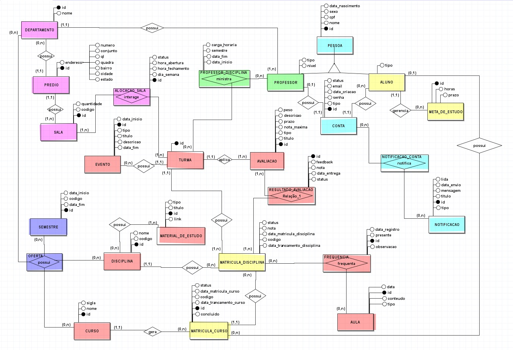

# 🎓 Sistema de Acompanhamento Acadêmico

Projeto da disciplina Banco de Dados da Universidade de Brasília (UnB), desenvolvido para monitorar a vida acadêmica de estudantes e facilitar o trabalho de professores.

## Visão Geral

O sistema permite a gestão de informações acadêmicas com foco em:

- notas e avaliações
- frequência de alunos
- geração de relatórios
- notificações de desempenho
- eventos acadêmicos

O objetivo é oferecer uma visão integrada do progresso estudantil durante o semestre.

---

## Integrantes

- Arthur Braga Moura de Jesus
- Calebe Alves Freitas
- Isabela de Souza Clímaco
- Vitor Ivan Gonçalves de Oliveira

---

## Principais Funcionalidades

### Para o aluno

- Consultar disciplinas matriculadas
- Visualizar notas e conceitos
- Acompanhar frequência
- Receber notificações de desempenho
- Consultar eventos acadêmicos
- Acompanhar metas de estudo

### Para o professor

- Registrar avaliações e notas
- Lançar frequência em turma
- Disponibilizar materiais e avisos
- Criar eventos acadêmicos

---

## Modelagem do Banco de Dados

O projeto foi baseado nas seguintes etapas:

- levantamento de requisitos
- modelagem conceitual (MER)
- diagrama entidade-relacionamento (DER)
- modelo relacional (MR)

### Diagrama DER

> A imagem do DER está disponível em `brModelo/DER.jpeg`.

---

## Entregas realizadas

- [Entrega 1: Documento de Requisitos](entregas/pdf/Entrega_1_Documento_de_Requisitos.pdf)
- [Entrega 2: MER Textual](entregas/pdf/Entrega_2_MER_Textual.pdf)

---

## Estrutura do repositório

- `brModelo/` — arquivos de modelagem, incluindo `DER.jpeg`
- `entregas/pdf/` — documentos de entrega
- `scripts/` — scripts SQL para criação de tabelas e outras rotinas

---

## Como usar

1. Abra os arquivos de entrega em `entregas/pdf/` para consultar o material de documentação.
2. Veja o diagrama de banco de dados em `brModelo/DER.jpeg`.
3. Use os scripts em `scripts/` para criar as tabelas e testar o banco de dados.
