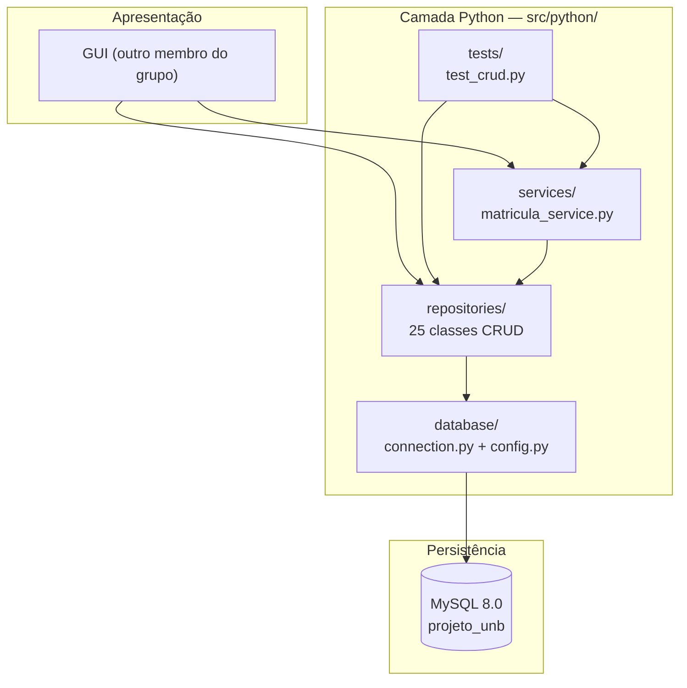

# Wiki — Sistema Acadêmico UnB

Documentação central do projeto de Banco de Dados (UnB, Prof. Díbio). Este documento é o ponto de entrada para entender, rodar e estender o sistema.

---

## 1. Visão Geral

O **Sistema de Acompanhamento Acadêmico** é uma plataforma de apoio para estudantes e professores da UnB, cobrindo:

- Acompanhamento de disciplinas, notas, frequência e materiais didáticos (aluno)
- Gestão de diários de classe, avaliações e eventos (professor)
- Notificações automáticas e metas de estudo pessoais

O banco de dados MySQL conta com **25 entidades** cobrindo desde infraestrutura física (departamentos, prédios, salas) até o controle acadêmico (matrículas, avaliações, frequência).

**Integrantes:** Arthur Braga, Calebe Alves, Isabela Clímaco, Vitor Ivan.

---

## 2. Arquitetura em Camadas



Cada seta representa uma dependência de chamada: a GUI e os testes consomem `services`/`repositories`; `services` orquestra múltiplos `repositories` quando uma operação envolve mais de uma tabela; todo acesso ao banco passa por `database/connection.py`. Nenhuma camada pula a que está abaixo dela.

---

## 3. Índice da Documentação

| Documento | Conteúdo |
|---|---|
| [Análise de Requisitos](entregas/1_analise_de_requesitos.md) | Levantamento de escopo e regras de negócio |
| [Textualização do MER](entregas/2_textualizacao_MER.md) | Modelo Entidade-Relacionamento em texto |
| [README do CRUD Python](../src/python/README.md) | Setup detalhado da camada Python |
| [README raiz do projeto](../README.md) | Visão geral, integrantes, funcionalidades |
| [Schema atual (DDL)](../src/sql/00_criar_tabelas.sql) | Fonte da verdade das 25 tabelas |
| [Diagrama Conceitual (DER)](../src/uml/conceitual/) | Modelo conceitual (brModelo) |
| [Diagrama Lógico (MR)](../src/uml/logico/) | Modelo relacional (brModelo + PlantUML) |

---

## 4. Como Rodar o Projeto do Zero

### 4.1. Pré-requisitos

- MySQL 8.0+ instalado e rodando localmente
- Python 3.11+

### 4.2. Setup do MySQL

Os scripts em `src/sql/` devem ser executados **nesta ordem**:

```bash
cd src/sql
mysql -u root -p < 00_criar_tabelas.sql
mysql -u root -p < 01_views.sql
mysql -u root -p < 02_procedures.sql
mysql -u root -p < 03_triggers.sql
mysql -u root -p < 04_alter_foto.sql
mysql -u root -p < 05_seeds.sql
```

| Ordem | Script | O que faz |
|---|---|---|
| 1 | `00_criar_tabelas.sql` | Recria o banco `projeto_unb` e as 25 tabelas |
| 2 | `01_views.sql` | Cria a view `vw_historico_aluno` |
| 3 | `02_procedures.sql` | Cria a procedure `sp_matricular_aluno_em_turma` |
| 4 | `03_triggers.sql` | Cria os triggers de recálculo de nota final |
| 5 | `04_alter_foto.sql` | Adiciona a coluna `foto LONGBLOB` em `pessoa` |
| 6 | `05_seeds.sql` | Popula as 25 tabelas com 5+ registros cada |

**Opção — rodar tudo de uma vez:** para evitar esquecer algum script individual (foi exatamente esse esquecimento que causou a falha documentada em [§ Problemas Comuns](#10-problemas-comuns--troubleshooting)), existe [`src/sql/run_all.sql`](../src/sql/run_all.sql), que executa os 6 scripts acima em sequência via `SOURCE`:

```bash
cd src/sql
mysql -u root -p < run_all.sql
```

> Rode a partir da pasta `src/sql/` — os caminhos dentro do script são relativos a ela.

### 4.3. Setup do ambiente Python

```bash
cd src/python
python -m venv venv
venv\Scripts\activate        # Windows
# source venv/bin/activate   # Linux/macOS
pip install -r requirements.txt
```

Configure o `.env` (não versionado) na raiz de `src/python/`:

```
DB_HOST=localhost
DB_PORT=3306
DB_USER=root
DB_PASSWORD=sua_senha
DB_NAME=projeto_unb
```

---

## 5. Como Rodar os Testes

```bash
cd src/python
python tests/test_crud.py
```

O script conecta ao banco e exercita, sem framework formal de testes, cada função CRUD das 13 entidades principais, a gravação/leitura da foto (BLOB), a procedure `sp_matricular_aluno_em_turma`, os triggers de recálculo de nota e a view `vw_historico_aluno`. Cada cenário imprime `[OK]` ou `[FALHA]`; ao final, um resumo lista quantos cenários falharam (se algum falhar).

---

## 6. Estrutura de Pastas do Projeto

```text
├── docs/
│   ├── WIKI.md                        # Este documento
│   ├── entregas/                      # Entregas formais da disciplina
│   └── especificacoes/                # Especificação do projeto e do tema
├── src/
│   ├── sql/                           # DDL, views, procedures, triggers, seeds
│   │   ├── 00_criar_tabelas.sql
│   │   ├── 01_views.sql
│   │   ├── 02_procedures.sql
│   │   ├── 03_triggers.sql
│   │   ├── 04_alter_foto.sql
│   │   ├── 05_seeds.sql
│   │   └── run_all.sql
│   ├── python/                        # Camada CRUD (sem GUI)
│   │   ├── database/                  # Conexão e configuração
│   │   ├── repositories/              # Acesso direto ao banco (SQL puro)
│   │   ├── services/                  # Regras de negócio multi-tabela
│   │   └── tests/                     # Validação end-to-end do CRUD
│   ├── uml/
│   │   ├── conceitual/                # DER (brModelo)
│   │   └── logico/                    # MR (brModelo + PlantUML)
│   └── sgbd/                          # Modelo físico (MySQL Workbench)
└── README.md
```

---

## 7. Scripts SQL Adicionais

### 7.1. View — `vw_historico_aluno` (`01_views.sql`)

Consolida o histórico escolar completo de um aluno: junta `pessoa`, `aluno`, `matricula_curso`, `curso`, `matricula_disciplina`, `turma`, `oferta`, `disciplina` e `semestre` numa única consulta, evitando que o Python precise fazer 8 `JOIN`s manualmente toda vez que exibir um histórico.

```sql
CREATE OR REPLACE VIEW vw_historico_aluno AS
SELECT
    p.id                            AS id_pessoa,
    p.nome                          AS nome_aluno,
    ...
    d.nome                          AS nome_disciplina,
    md.nota                         AS nota_final,
    md.status                       AS status_matricula_disciplina
FROM pessoa p
JOIN aluno               a  ON a.id_pessoa          = p.id
JOIN matricula_curso     mc ON mc.id_aluno           = a.id_pessoa
JOIN curso               c  ON c.id                 = mc.id_curso
JOIN matricula_disciplina md ON md.id_matricula_curso = mc.id
JOIN turma               t  ON t.id                 = md.id_turma
JOIN oferta              o  ON o.id                 = t.id_oferta
JOIN disciplina          d  ON d.id                 = o.id_disciplina
JOIN semestre            s  ON s.id                 = o.id_semestre;
```

Consumida por `services/matricula_service.py::buscar_historico_aluno(id_aluno)`, que filtra por `id_pessoa`.

### 7.2. Procedure — `sp_matricular_aluno_em_turma` (`02_procedures.sql`)

Insere um registro em `matricula_disciplina` após validar que a turma existe e tem vagas — a lógica de validação fica no banco para garantir atomicidade mesmo com acessos concorrentes.

```sql
CREATE PROCEDURE sp_matricular_aluno_em_turma(
    IN p_id_matricula_curso INT,
    IN p_id_turma           INT
)
BEGIN
    DECLARE v_vagas        INT;
    DECLARE v_matriculados INT;

    SELECT quantidade_vagas INTO v_vagas FROM turma WHERE id = p_id_turma;
    IF v_vagas IS NULL THEN
        SIGNAL SQLSTATE '45000' SET MESSAGE_TEXT = 'Turma não encontrada';
    END IF;

    SELECT COUNT(*) INTO v_matriculados FROM matricula_disciplina
    WHERE id_turma = p_id_turma AND status != 'TRANCADO';

    IF v_matriculados >= v_vagas THEN
        SIGNAL SQLSTATE '45000' SET MESSAGE_TEXT = 'Turma sem vagas disponíveis';
    END IF;

    INSERT INTO matricula_disciplina (...) VALUES (...);
    SELECT LAST_INSERT_ID() AS id_matricula_disciplina;
END
```

Chamada por `services/matricula_service.py::matricular_aluno_em_disciplina` via `cursor.callproc(...)`. Erros de negócio (turma cheia, turma inexistente) chegam ao Python como `mysql.connector.Error` e são convertidos em `{"ok": False, "erro": ...}`.

### 7.3. Triggers — recálculo de nota final (`03_triggers.sql`)

MySQL não permite `AFTER INSERT OR UPDATE` num único trigger, então há dois triggers idênticos em lógica: `tg_atualiza_nota_final_insert` e `tg_atualiza_nota_final_update`. Ambos recalculam a média ponderada das avaliações sempre que um `resultado_avaliacao` é gravado ou corrigido, e gravam o resultado em `matricula_disciplina.nota`:

```sql
CREATE TRIGGER tg_atualiza_nota_final_insert
AFTER INSERT ON resultado_avaliacao
FOR EACH ROW
BEGIN
    DECLARE v_nota DECIMAL(5,2);

    SELECT SUM(ra.nota * av.peso) / NULLIF(SUM(av.peso), 0)
    INTO v_nota
    FROM resultado_avaliacao ra
    JOIN avaliacao av ON av.id = ra.id_avaliacao
    WHERE ra.id_matricula_disciplina = NEW.id_matricula_disciplina
      AND ra.nota IS NOT NULL;

    UPDATE matricula_disciplina
    SET nota = v_nota
    WHERE id = NEW.id_matricula_disciplina;
END
```

O Python **nunca** escreve diretamente em `matricula_disciplina.nota` — ele só insere/atualiza `resultado_avaliacao` e lê a nota recalculada de volta. Isso é validado em `testar_avaliacao_e_trigger()` no `test_crud.py`.

### 7.4. Dado binário — coluna `foto` (`04_alter_foto.sql`)

```sql
ALTER TABLE pessoa
    ADD COLUMN foto LONGBLOB;
```

Armazena a foto de perfil de qualquer `pessoa` (aluno ou professor) como `LONGBLOB`. `PessoaRepository` expõe `update_foto(id, bytes)` e `find_foto(id)` para gravar/ler o binário sem passar pelos demais campos — evita trafegar o BLOB em todo `SELECT *` de pessoa.

---

## 8. Camada de Persistência

### 8.1. Padrão Repository

Cada tabela principal tem uma classe `*Repository` responsável por todo o SQL que a toca (`CREATE`, `find_by_id`, `find_all`, `UPDATE`, `DELETE`, mais métodos de consulta específicos como `find_by_aluno`). O objetivo é isolar SQL puro num só lugar por entidade — nenhuma outra camada escreve queries diretamente contra as tabelas.

Foi escolhido em vez de um ORM porque:
- O projeto exige domínio explícito de SQL (é uma disciplina de Banco de Dados)
- Facilita mapear 1:1 cada requisito da modelagem para uma consulta auditável
- A camada de CRUD precisa ser simples de consumir pela GUI, sem exigir que quem a use entenda um ORM

### 8.2. Papel de cada camada

| Camada | Pasta | Responsabilidade |
|---|---|---|
| Conexão | `database/` | `config.py` lê `.env`; `connection.py` abre conexões MySQL |
| Repositórios | `repositories/` | Um CRUD por entidade, SQL puro, sem regra de negócio |
| Serviços | `services/` | Orquestra múltiplos repositórios numa operação de negócio (ex.: matricular um aluno envolve validar tipo de aluno, matrícula ativa, vagas e inserir a matrícula) |
| Testes | `tests/` | Valida end-to-end cada repositório e serviço contra um banco real |

### 8.3. Como as camadas se comunicam

```python
# services/matricula_service.py
def matricular_aluno_em_disciplina(id_pessoa, id_oferta):
    conn = get_connection()                          # database/
    aluno_repo = AlunoRepository(conn)                # repositories/
    mc_repo = MatriculaCursoRepository(conn)
    turma_repo = TurmaRepository(conn)

    aluno = aluno_repo.find_by_id(id_pessoa)          # valida
    mc = mc_repo.find_ativa_por_aluno(id_pessoa)      # valida
    turmas = turma_repo.find_by_oferta(id_oferta)     # busca

    cursor = conn.cursor()
    cursor.callproc("sp_matricular_aluno_em_turma", [mc["id"], turmas[0]["id"]])
    ...
```

Um `service` nunca escreve SQL diretamente contra tabelas — ele delega a repositórios (ou chama uma procedure) e só adiciona a lógica de orquestração/validação que não cabe em um único repositório.

---

## 9. Como Estender — Adicionando um Novo Repository

Exemplo seguindo o padrão de `DepartamentoRepository` (o mais simples existente, sem FKs):

**1. Crie o arquivo** `repositories/minha_entidade_repository.py`:

```python
from repositories.base_repository import BaseRepository


class MinhaEntidadeRepository(BaseRepository):

    def create(self, campo1, campo2):
        cursor = self._cursor()
        cursor.execute(
            "INSERT INTO minha_entidade (campo1, campo2) VALUES (%s, %s)",
            (campo1, campo2),
        )
        self.conn.commit()
        return cursor.lastrowid

    def find_by_id(self, id_entidade):
        cursor = self._cursor()
        cursor.execute("SELECT * FROM minha_entidade WHERE id = %s", (id_entidade,))
        return cursor.fetchone()

    def find_all(self):
        cursor = self._cursor()
        cursor.execute("SELECT * FROM minha_entidade ORDER BY id")
        return cursor.fetchall()

    def update(self, id_entidade, **campos):
        # veja pessoa_repository.py para um exemplo de UPDATE dinâmico
        ...

    def delete(self, id_entidade):
        cursor = self._cursor()
        cursor.execute("DELETE FROM minha_entidade WHERE id = %s", (id_entidade,))
        self.conn.commit()
        return cursor.rowcount
```

**2. Herde de `BaseRepository`** — isso já dá acesso a `self.conn` e `self._cursor()` (cursor com `dictionary=True`, para retornar `dict` em vez de tupla).

**3. Não coloque regra de negócio no repository.** Se a operação envolve mais de uma tabela ou validação (ex.: "só pode criar X se Y existir"), isso vai em `services/`, não no repository.

**4. Adicione um cenário em `tests/test_crud.py`** seguindo o padrão de `testar_departamento()`: `create` → `find_by_id` → `update` → `find_all` → `delete`, cada passo validado com `ok()`/`falha()`.

**5. Se a tabela precisar existir**, ela já deve estar em `src/sql/00_criar_tabelas.sql` — schema é sempre criado antes do código Python que o consome.

---

## 10. Problemas Comuns / Troubleshooting

| Sintoma | Causa provável | Solução |
|---|---|---|
| `ProgrammingError: Table 'projeto_unb.vw_historico_aluno' doesn't exist` | O banco foi recriado (`00_criar_tabelas.sql`) mas `01_views.sql` não foi reexecutado depois | Rode `mysql -u root -p projeto_unb < src/sql/01_views.sql` (ou use `run_all.sql` para não esquecer nenhum script) |
| Nota final não atualiza automaticamente após lançar `resultado_avaliacao` | Os triggers `tg_atualiza_nota_final_*` não existem no banco atual | Rode `mysql -u root -p projeto_unb < src/sql/03_triggers.sql` |
| Erro de conexão MySQL (`Access denied`, `Can't connect`) | `.env` ausente, com credenciais erradas, ou MySQL não está rodando | Confira `src/python/.env` (host, porta, usuário, senha, `DB_NAME`) e se o serviço MySQL está ativo |
| `'mysql' não é reconhecido como um comando interno ou externo` (Windows) | O binário do MySQL não está no `PATH` | Adicione `C:\Program Files\MySQL\MySQL Server 8.0\bin` ao `PATH` do Windows, ou chame o executável pelo caminho completo |
| Python reclama de coluna/tabela que "deveria existir" | O banco local está desatualizado em relação a `src/sql/` (algum script da sequência não foi rodado, ou foi rodado fora de ordem) | Recrie o banco do zero com `run_all.sql`, que sempre roda os 6 scripts na ordem correta |

---

## 11. Glossário

- **SGBD** — Sistema de Gerenciamento de Banco de Dados (aqui, MySQL 8.0)
- **ACID** — Atomicidade, Consistência, Isolamento e Durabilidade: garantias que uma transação deve cumprir
- **Prepared statement** — consulta SQL parametrizada (`%s` no `mysql-connector-python`), evita SQL injection e permite reuso do plano de execução
- **Integridade referencial** — garantia de que uma FK sempre aponta para um registro existente na tabela referenciada
- **FK (Foreign Key)** — chave estrangeira; vínculo entre tabelas
- **Trigger** — bloco de código executado automaticamente pelo SGBD em resposta a um `INSERT`/`UPDATE`/`DELETE`
- **View** — consulta salva que se comporta como uma tabela somente-leitura (aqui, `vw_historico_aluno`)
- **Procedure armazenada (stored procedure)** — bloco de lógica SQL nomeado, executado no servidor (aqui, `sp_matricular_aluno_em_turma`)
- **BLOB (Binary Large Object)** — tipo de coluna para dados binários; usamos `LONGBLOB` para a foto de `pessoa`
- **ORM (Object-Relational Mapping)** — camada que mapeia objetos a tabelas automaticamente; **não usado neste projeto** — o padrão Repository com SQL puro foi escolhido deliberadamente (ver [§ 8.1](#81-padrão-repository))
- **Migração de schema** — mudança versionada e reprodutível na estrutura do banco (aqui, os scripts numerados em `src/sql/`)
